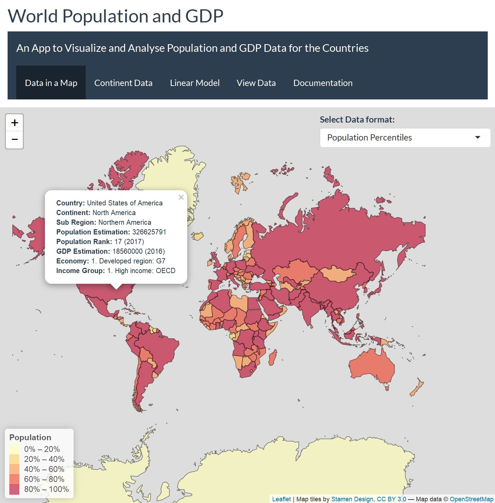
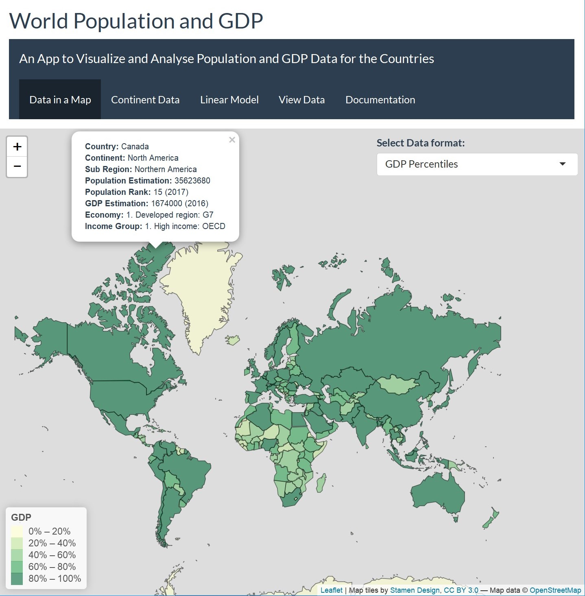
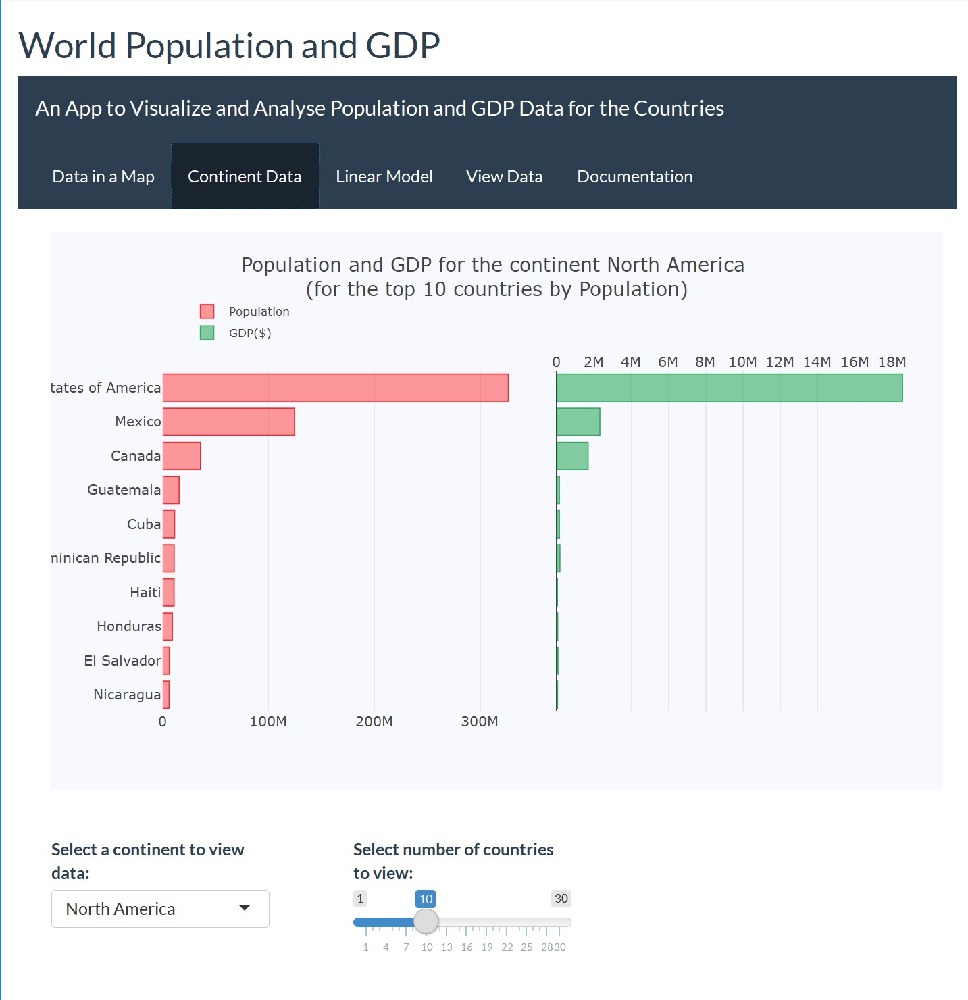
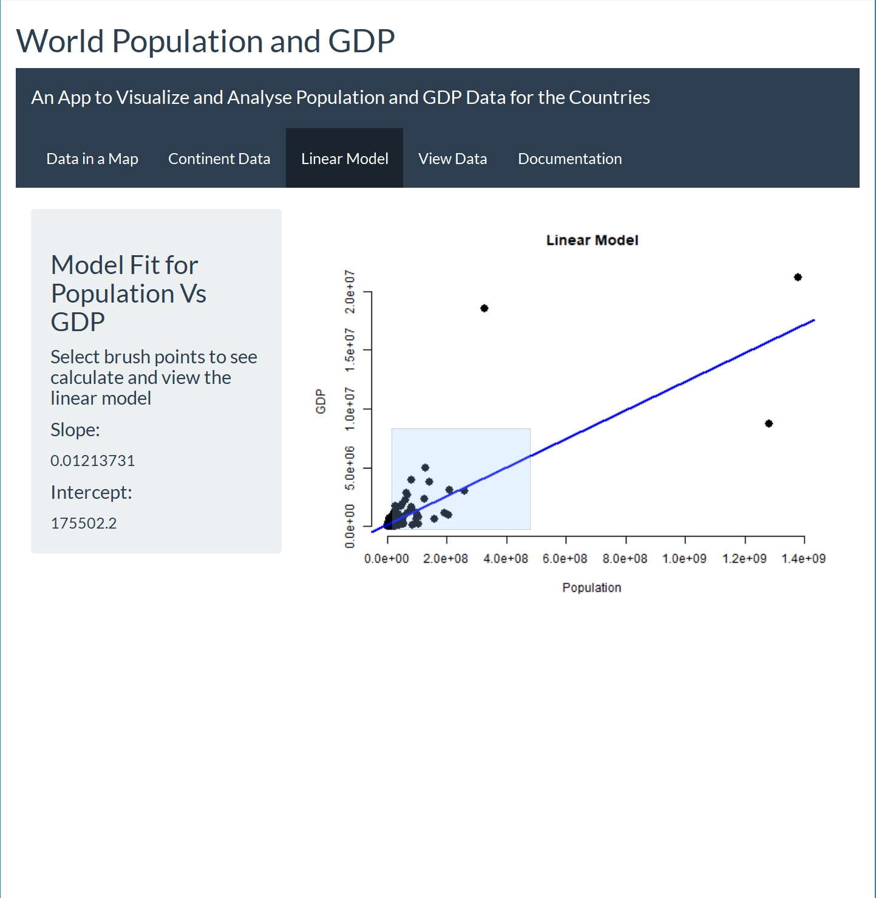
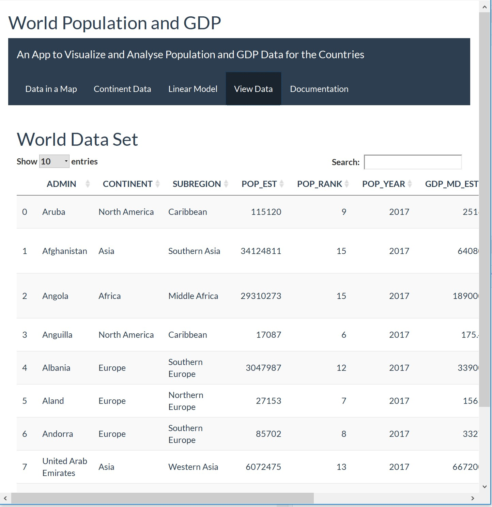
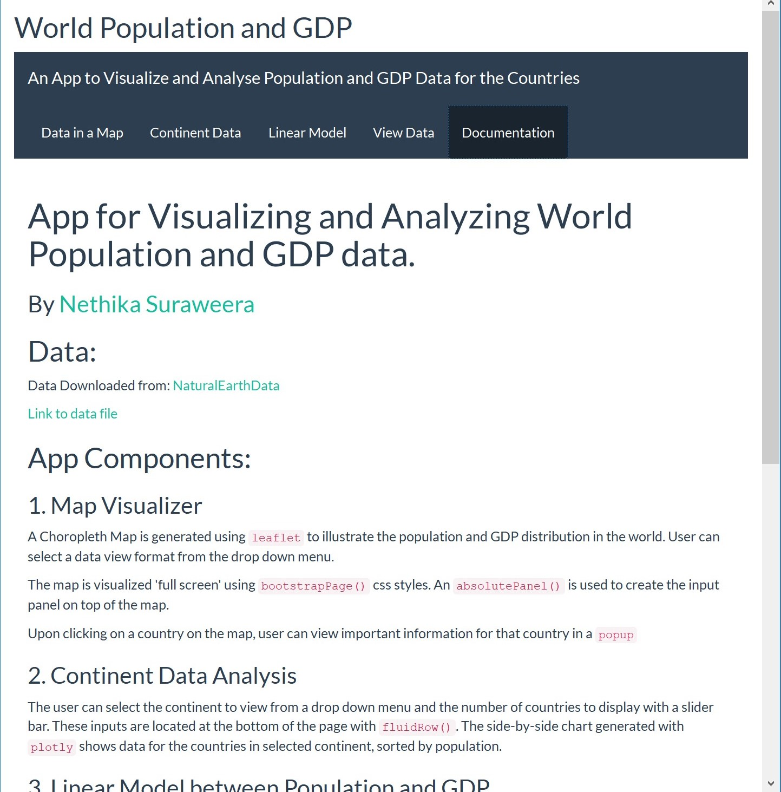

```{r setup, include=FALSE}
knitr::opts_chunk$set(echo = TRUE)
```

## App Components: {.smaller}
- Map Visualize
- Continent Data Analysis
- Linear Model between Population and GDP
- Data Set View
- Documentation

###### Effects:
- A Choropleth Map is generated using `leaflet`.
- Map uses `bootstrapPage()`  and `absolutePanel()`.
- `plotly` charts with user inputs.
- User selects brush points and a linear model is calculated.
- App theme "flatly" from the R package `shinythemes`.
- A top level navigation bar created using `navbarPage()`.

Link to the app: https://nethika.shinyapps.io/world_population_gdp/"

## Data to Visualizations {.smaller}
Loading data and Creating Plot (echo = FALSE)
```{r, echo = FALSE, message=FALSE, warning=FALSE}
library(rgdal)
library(leaflet)
library(plotly)
library(dplyr)
#load data
tmp <- tempdir()
url <- "http://www.naturalearthdata.com/http//www.naturalearthdata.com/download/50m/cultural/ne_50m_admin_0_countries.zip"
file <- basename(url)
download.file(url, file)
unzip(file, exdir = tmp)
world <- readOGR(dsn = tmp, layer ='ne_50m_admin_0_countries', encoding='UTF-8')


datax <- world@data
continent_name = "North America"
cont_data = datax[datax$CONTINENT == continent_name,]
## Filter top n
n <- 10
topnData <- cont_data %>% 
  filter(rank(desc(POP_EST))<= n)

p1 <- plot_ly(topnData,x = ~POP_EST, y = ~reorder(ADMIN, POP_EST), name = 'Population',
              type = 'bar', orientation = 'h',
              marker = list(color = 'rgba(255, 0, 0, 0.4)',
                            line = list(color = 'rgba(255, 0, 0,, 0.8)', width = 1))) %>%
  layout(yaxis = list(showgrid = FALSE, showline = FALSE, showticklabels = TRUE, domain= c(0, 0.85)),
         xaxis = list(zeroline = FALSE, showline = FALSE, showticklabels = TRUE, showgrid = TRUE)) 


p2 <- plot_ly(topnData, x = ~GDP_MD_EST , y = ~reorder(ADMIN, POP_EST), name = 'GDP($)',
              type = 'bar', orientation = 'h',
              marker = list(color = 'rgba(50, 171, 96, 0.6)',
                            line = list(color = 'rgba(50, 171, 96, 1.0)', width = 1))) %>%
  layout(yaxis = list(showgrid = FALSE, showline = TRUE, showticklabels = FALSE,
                      domain = c(0, 0.85)),
         xaxis = list(zeroline = FALSE, showline = FALSE, showticklabels = TRUE, showgrid = TRUE,
                      side = 'top', dtick = 2000000)) 


p <- subplot(p1, p2) %>%
  layout(title = paste0('Population and GDP for the continent ',continent_name ,' \n (for the top ',
                        n, ' countries by Population)'),
                         legend = list(x = 0.029, y = 1.038,
                                       font = list(size = 10)),
                         margin = list(l = 100, r = 20, t = 70, b = 70),
                         paper_bgcolor = 'rgb(248, 248, 255)',
                         plot_bgcolor = 'rgb(248, 248, 255)') 
p


```

## Map Visualization {.smaller}
```{r, echo=TRUE, message=FALSE, warning=FALSE}
pal <- colorQuantile("YlOrRd", NULL, n = 5)
leaflet(data = world) %>% addProviderTiles(providers$Stamen.TonerLite) %>% setView(25.01667, 24.86667, zoom = 1.5) %>%
  addPolygons(fillColor = ~pal(POP_EST),fillOpacity = 0.6,color = "black",weight = 1) %>% 
  addLegend(pal = pal, values = ~POP_EST, opacity = 0.6,labFormat = labelFormat(), title = "Population", position = "bottomleft")
```

## Screen Shots from App. [Link for the app](https://nethika.shinyapps.io/world_population_gdp/) {.smaller}

<div id="bg">
  
  
  
  
  
  
</div> 
