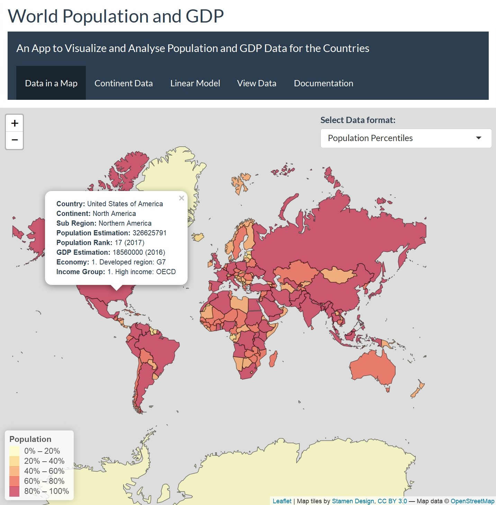
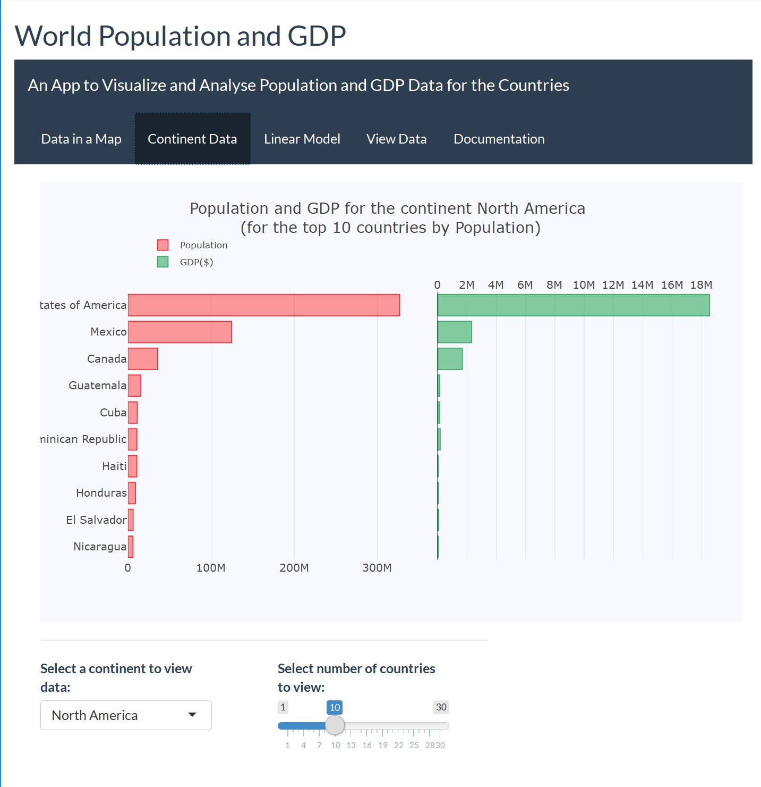
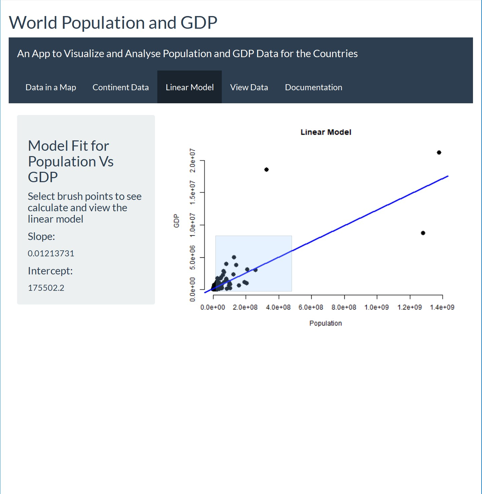

# App for Visualizing and Analyzing World Population and GDP data.
### By [Nethika Suraweera](https://www.linkedin.com/in/nethika/)             
## Data:
Data Downloaded from: [NaturalEarthData](http://www.naturalearthdata.com/)

[Link to data file](http://www.naturalearthdata.com/http//www.naturalearthdata.com/download/50m/cultural/ne_50m_admin_0_countries.zip)

## App Components:
### 1. Map Visualizer

A Choropleth Map is generated using `leaflet` to illustrate the population and GDP distribution in the world. User can select a data view format from the drop down menu.

The map is visualized 'full screen' using `bootstrapPage()` css styles. An `absolutePanel()` is used to create the input panel on top of the map.

Upon clicking on a country on the map, user can view important information for that country in a `popup`

### 2. Continent Data Analysis

The user can select the continent to view from a drop down menu and the number of countries to display with a slider bar. These inputs are located at the bottom of the page with `fluidRow()`. The side-by-side chart generated with `plotly` shows data for the countries in selected continent, sorted by population.

             
### 3. Linear Model between Population and GDP

A simple linear model is generated between population and GDP. User can select brush points on the plot and the calculated linear model is visualized on the plot. It also outputs slope and intercept values calculated in the `sidebarPanel()`.

### 4. Data Set View

The R package `DT` is used to create a data table from a R data frame. Only the important columns are included.

## Other Effects:

This app uses the theme "flatly" from the R package `shinythemes`.

A top level navigation bar created using `navbarPage()` allows the user to navigate between tab panels.

## Packages used:

- shiny
- leaflet
- plotly
- shinythemes
- rgdal
- dplyr
- RColorBrewer
- DT

## Screen Shots from App. [Link for the app](https://nethika.shinyapps.io/world_population_gdp/)

  
  
  
  
  
  

 

##  [Link for the Presentation](http://rpubs.com/nethika/shiny_presentation)
